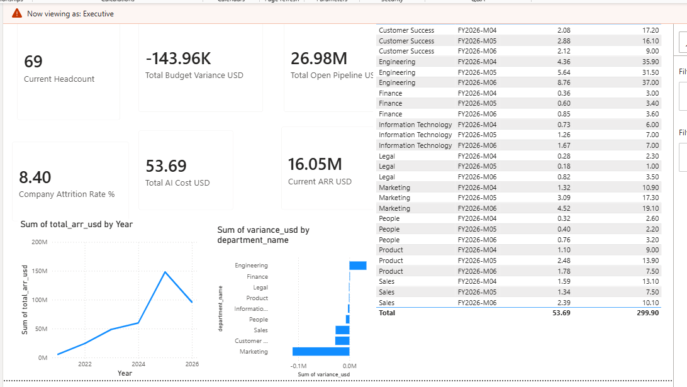
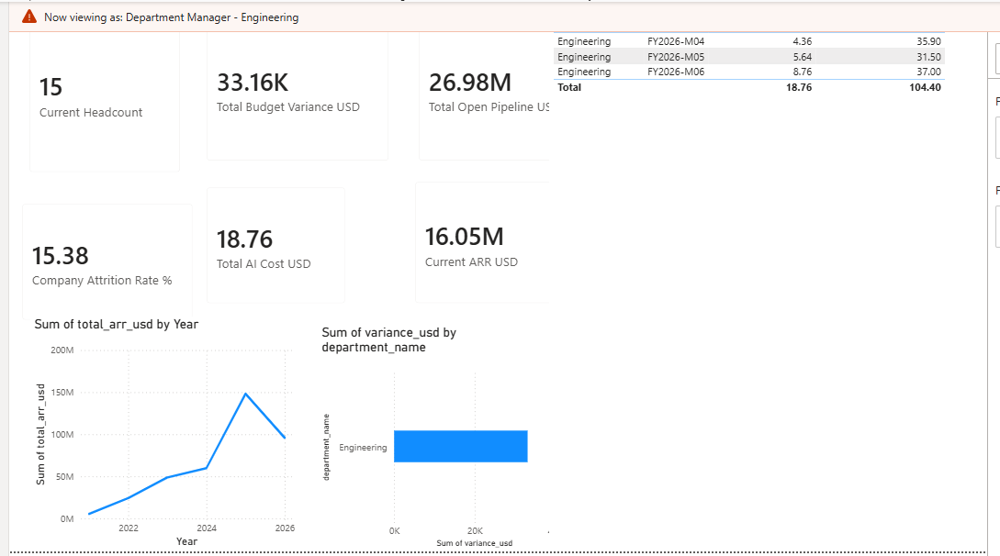

# intus

*intus* (Latin: "within") is a complete internal data platform for **Halcyon**, a
fictional mid-size B2B software company: synthetic data → a legacy Postgres star schema
→ a Databricks lakehouse → governance → a BI dashboard. Everything is deterministic,
tested and documented, so each layer can be checked against the one below it.

## The pieces

**`gen/` — synthetic data.** Twelve datasets across six domains (HR, sales and revenue,
product usage, LLM/AI cost, budgets vs. actuals, access logs), ~1.8M rows at full scale,
generated deterministically from a seed. Nineteen data-quality defects are seeded
deliberately and recorded in a ground-truth manifest, and every column carries a
sensitivity tier (public / internal / confidential / restricted) declared at generation
time — so governance downstream is testable against known truth.

**`warehouse/` — the legacy warehouse.** Postgres 16, plain-SQL ETL, a forward-only
migration runner. Five dimensions (including a type-2 `dim_employee` whose no-overlap
invariant is a GiST exclusion constraint), ten facts, and seven reporting views, each
built around a different window-function technique. `intus-wh dq-score` grades detected
problems against the seeded defects and reports false positives too: 19/19 defect types
at 100% recall, zero false positives.

**`lakehouse/` — the migration to Databricks.** The same model as bronze/silver/gold in
Unity Catalog SQL. `intus-lakehouse parity` compares every row of all seven view pairs
across both platforms against one shared extract: **7/7 match exactly**. Doing that
found two real dialect rewrites and one genuine bug in the original Postgres view.
`docs/CUTOVER_PLAN.md` writes up the parallel run.

**Governance.** Unity Catalog row filters and column masks attached to silver and
inherited automatically by the gold views on top, for seven personas. Row scope and
column capability are independent axes — a department manager can see that a
compensation record exists without seeing the amount. Every restricted-tier column the
generators declare is masked, checked against the classification rather than by hand.
`docs/ACCESS_REVIEW.md` and `docs/CHANGE_CONTROL.md` are the SOX-style evidence.

**`powerbi/` — consumption.** A DirectQuery dashboard over `intus.gold.*` with RLS roles
mirroring the Unity Catalog personas, so the same access rules hold at the last hop.

All phases are complete. `docs/BUILD_LOG.md` has the running narrative,
`docs/DECISIONS.md` the design decisions with alternatives considered, and
`docs/data-catalog.md` (generated) the full column-level classification.

## The star schema

Five dimensions, ten facts. The same table and column names exist on both platforms —
`warehouse.*` in Postgres, `intus.silver.*` in Unity Catalog — so a query written
against one runs on the other with the schema name swapped.

```mermaid
erDiagram
    dim_date       ||--o{ fact_compensation : date_key
    dim_employee   ||--o{ fact_compensation : employee_key
    dim_date       ||--o{ fact_performance_review : date_key
    dim_employee   ||--o{ fact_performance_review : "employee_key, reviewer_employee_key"
    dim_date       ||--o{ fact_subscription : "start_date_key, end_date_key"
    dim_account    ||--o{ fact_subscription : account_key
    dim_product    ||--o{ fact_subscription : product_key
    dim_date       ||--o{ fact_invoice : "issue_date_key, due_date_key, paid_date_key"
    dim_account    ||--o{ fact_invoice : account_key
    dim_date       ||--o{ fact_opportunity : "created_date_key, close_date_key"
    dim_account    ||--o{ fact_opportunity : account_key
    dim_employee   ||--o{ fact_opportunity : owner_employee_key
    dim_product    ||--o{ fact_opportunity : product_key
    dim_date       ||--o{ fact_usage_daily : date_key
    dim_account    ||--o{ fact_usage_daily : account_key
    dim_product    ||--o{ fact_usage_daily : product_key
    dim_date       ||--o{ fact_ai_usage : date_key
    dim_employee   ||--o{ fact_ai_usage : employee_key
    dim_department ||--o{ fact_ai_usage : department_key
    dim_date       ||--o{ fact_access_event : date_key
    dim_employee   ||--o{ fact_access_event : employee_key
    dim_department ||--o{ fact_access_event : department_key
    dim_date       ||--o{ fact_gl_actual : date_key
    dim_employee   ||--o{ fact_gl_actual : posted_by_employee_key
    dim_department ||--o{ fact_gl_actual : department_key
    dim_date       ||--o{ fact_budget : approved_date_key
    dim_employee   ||--o{ fact_budget : approved_by_employee_key
    dim_department ||--o{ fact_budget : department_key
```



### Dimensions

| Dimension | Key | Natural key | Notes |
|---|---|---|---|
| `dim_date` | `date_key` = `YYYYMMDD` | `full_date` | Calendar *and* fiscal attributes (`fiscal_period`, `fiscal_quarter`, `fiscal_year`), so finance facts don't re-derive them |
| `dim_department` | `department_key` | `department_code` | Conformed: code and name from HR, `cost_center` from finance |
| `dim_employee` | `employee_key` | `(employee_id, valid_from)` | **Type 2** — one row per version, `valid_to` exclusive and NULL when open. `is_current` means latest version, *not* still employed |
| `dim_account` | `account_key` | `account_id` | Type 1: the CRM extract carries only current state |
| `dim_product` | `product_key` | `product_code` | Type 1, tiny |

### Facts

| Fact | Grain — one row per… | Dimension keys | Measures |
|---|---|---|---|
| `fact_compensation` | compensation change | `employee_key`, `date_key` | `annual_salary_usd`, `bonus_target_pct`, `equity_units` |
| `fact_performance_review` | review | `employee_key`, `reviewer_employee_key`, `date_key` | `rating`, `promotion_recommended` |
| `fact_subscription` | subscription | `account_key`, `product_key`, `start_date_key`, `end_date_key` | `seats`, `arr_usd` |
| `fact_invoice` | invoice | `account_key`, `issue_date_key`, `due_date_key`, `paid_date_key` | `amount_usd` (plus `status`) |
| `fact_opportunity` | opportunity | `account_key`, `owner_employee_key`, `product_key`, `created_date_key`, `close_date_key` | `amount_usd`, `probability_pct`, `is_won` |
| `fact_usage_daily` | date × account × product | `date_key`, `account_key`, `product_key` | `active_users`, `sessions`, `api_calls`, `storage_gb`, `avg_latency_ms`, `error_count` |
| `fact_ai_usage` | LLM request | `employee_key`, `department_key`, `date_key` | `prompt_tokens`, `completion_tokens`, `cost_usd`, `latency_ms` |
| `fact_access_event` | login / access event | `employee_key`, `department_key`, `date_key` | count-only, plus `result` and `mfa_used` |
| `fact_gl_actual` | posted GL line | `department_key`, `posted_by_employee_key`, `date_key` | `amount_usd` |
| `fact_budget` | department × period × GL account | `department_key`, `approved_by_employee_key`, `approved_date_key` | `budget_usd` |

`fact_invoice.subscription_id` and the finance facts' `fiscal_period` are *degenerate*
dimensions — business keys held on the fact rather than a table of their own.
`fact_usage_daily` has no surrogate primary key: its grain is already its natural key.

### Four things that will bite you

- **`dim_employee` is type 2, so it has more rows than employees.** Any metric over it
  needs `COUNT(DISTINCT employee_id)` — counting rows counts SCD spans. Doing this
  wrong here once produced a 4883% attrition rate.
- **Every dimension has an `UNKNOWN` member at key `-1`**, used when a fact's foreign
  key doesn't resolve. It keeps joins inner rather than outer, but you have to exclude
  it explicitly (`WHERE employee_key <> -1`) when reasoning about real rows.
- **Joining a fact to `dim_employee` on `employee_key` gives you the version in force
  at the time of the event**, not the person's current state. For "as they are now",
  join back through `employee_id` with `is_current`.
- **Two key-lookup functions, and the difference matters.**
  `employee_key_as_of(employee_id, date)` is strict and returns NULL when no version
  covers the date; `employee_key_best(...)` falls back to the nearest known version.
  Every fact *stores* the `best` key; the `as_of` NULL is what data-quality rules are
  built on — the post-termination-login rule is literally "`as_of` returned NULL".

## Running it

Requires [uv](https://docs.astral.sh/uv/), Python 3.12, and Docker for the warehouse.

```bash
uv sync                   # create the environment from uv.lock
make test                 # run every suite
make lint                 # ruff format check + lint
make generate             # full dataset into data/raw (~90s)
SCALE=small make generate # a fast subset for iterating
make catalog              # regenerate docs/data-catalog.md from the schemas
```

The warehouse (Postgres on port 5433, so it can coexist with a local instance on the
default port):

```bash
make warehouse   # up + migrate + load + build + score, from scratch
make up          # start Postgres and wait for it
make migrate     # apply pending SQL migrations
make load        # truncate and reload staging from data/raw
make build       # run the transforms that build the star schema
make dq-score    # grade detections against the generator's defect manifest
make psql        # a psql shell in the container
make db-status   # connection and migration state
make down        # stop, keeping data;  make db-clean  also drops the volume
```

`make warehouse` then `make psql` is also a decent standalone SQL sandbox: a realistic
star schema with messy-but-known data already loaded, and seven reporting views
(`reporting.rpt_headcount_trend`, `rpt_attrition_by_department`,
`rpt_sales_pipeline_by_rep`, `rpt_revenue_trend`, `rpt_product_usage_trend`,
`rpt_ai_cost_by_department`, `rpt_budget_variance`) to read or take apart.

Generated data is gitignored: a deterministic generator plus a committed manifest is a
better record than several hundred megabytes of CSV. The same seed produces
byte-identical output on any machine, which is what makes the manifest's per-file
SHA-256 worth recording.

The Databricks lakehouse (Unity Catalog catalog `intus`, on a shared workspace):

```bash
databricks auth login --host <workspace URL>  # one-time, browser-based
make land         # upload data/raw/*.csv to the Unity Catalog landing volume
make deploy-job   # deploy the bundle in databricks.yml
make run-job      # run the lakehouse build (deploy-job's changes must be on main first)
```

`DATABRICKS_HOST` (in `.env`, see `.env.example`) points all of these at the right
workspace.

The dashboard: open `powerbi/intus_exec_dashboard.pbix` in
[Power BI Desktop](https://www.microsoft.com/en-us/power-platform/products/power-bi/desktop)
(free, Windows only). It's a live DirectQuery connection, so it needs a personal access
token for the workspace; `docs/POWERBI_MODEL.md` has the connection spec, DAX measures
and RLS role definitions. The screenshots below are Desktop's **View As** feature
previewing the same report as each role:

| Executive (no row filter) | Department Manager – Engineering (row-filtered) |
|---|---|
|  |  |

Headcount, attrition, budget variance and AI cost all shrink to Engineering-only under
the second role; revenue and open pipeline (neither has a department column) are
identical in both — the row-scope-vs-column-capability split from Unity Catalog,
reproduced at the BI layer.

## Relationship to `parvum`

[parvum](https://github.com/ambarshukla/parvum) is this project's sibling: a
client-facing portfolio-data platform (custody-file ingestion → lakehouse → serving APIs
→ dashboards). *intus* takes the other half — internal data, strict access control, and
platform modernization. Shared DNA, different problems.
